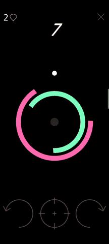

# Reach the Center
Reach the Center is the 2D arcade game being made with Unity, designed for Android platform in mind mostly.
The goal for the player controlling the dot is to reach the center, guarded by rotating circles.

